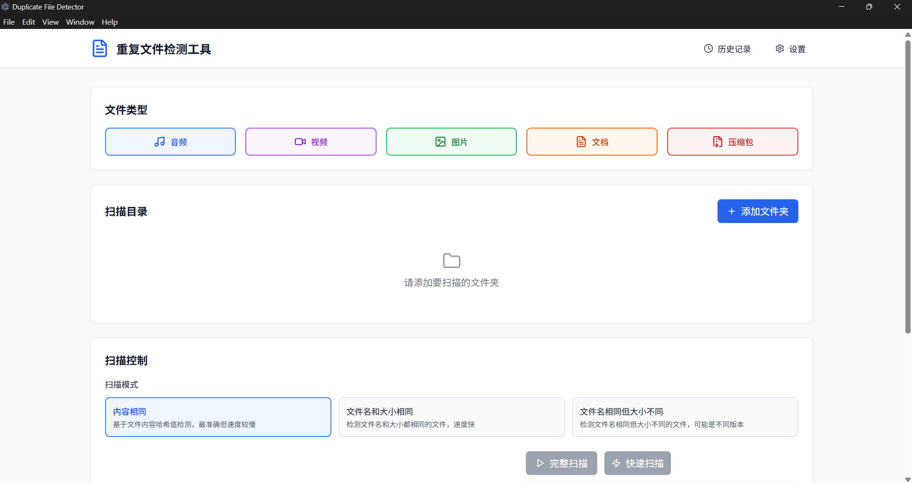
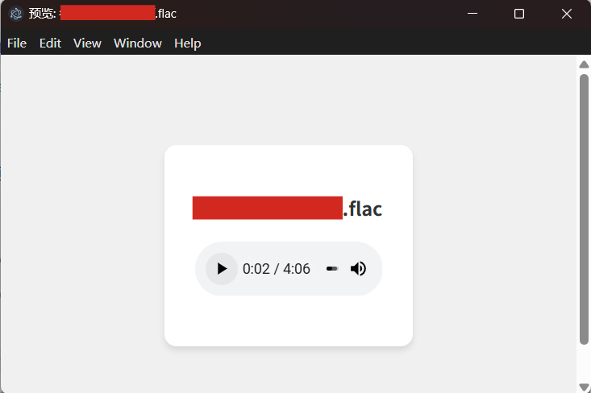
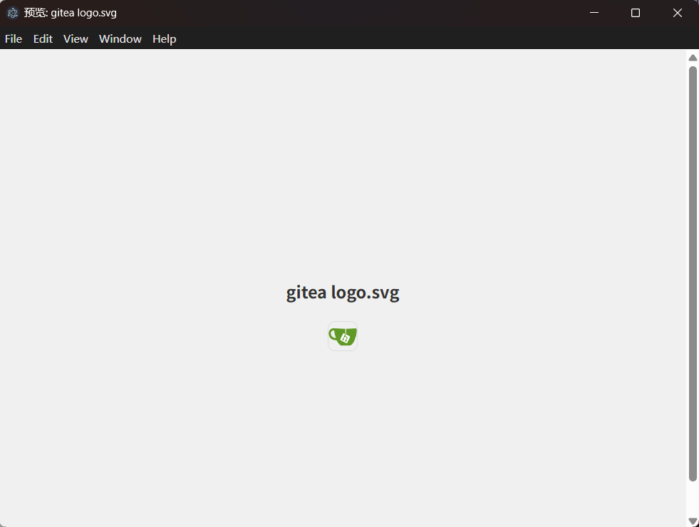
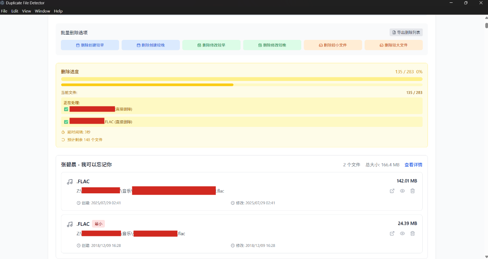
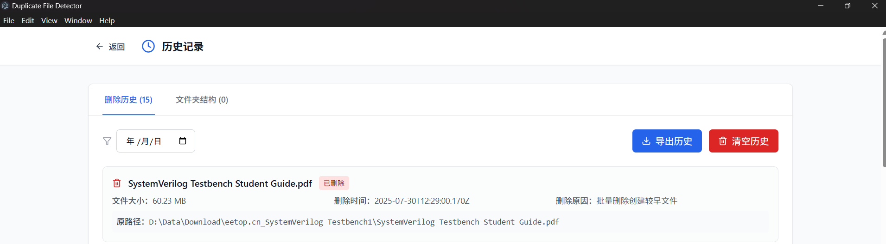
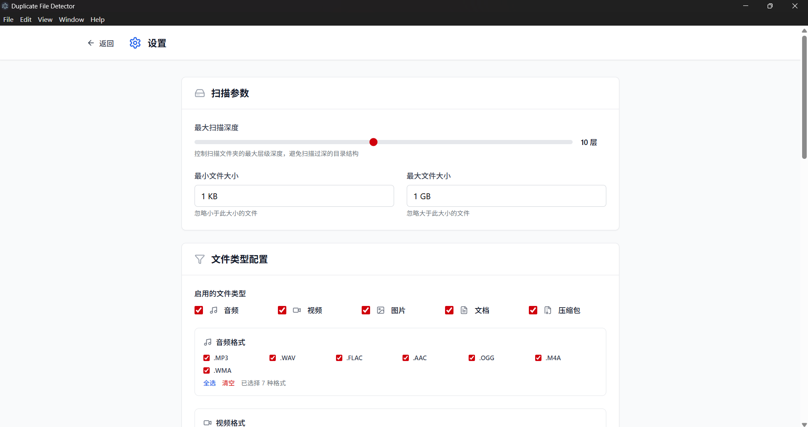
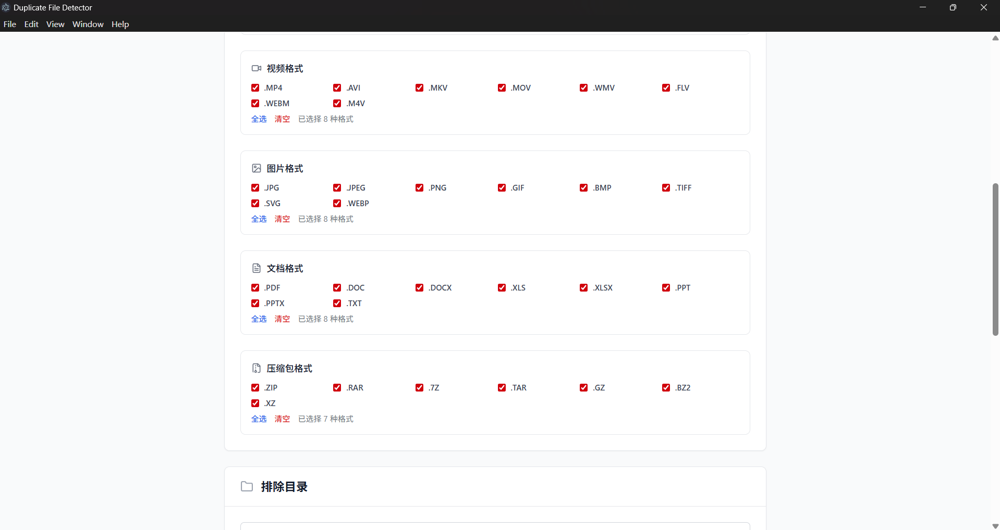
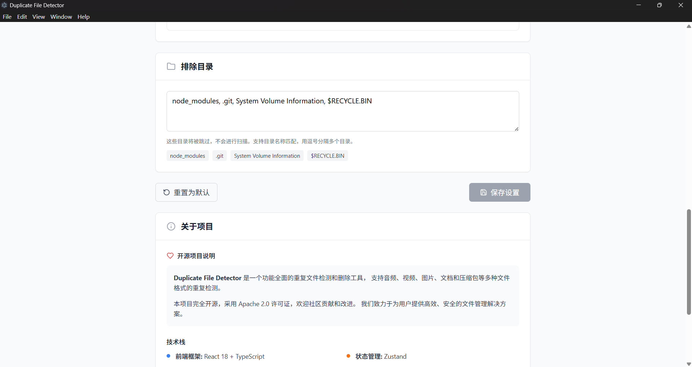
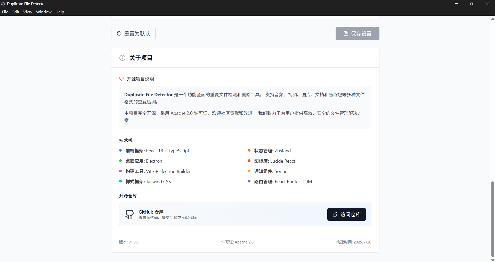

<div align="center">

#  重复文件检测工具 (桌面版)

**Duplicate File Detector - Desktop App**

*一个基于 Electron 的现代化桌面应用，真实访问本地文件系统，功能强大、界面美观的重复文件检测和删除工具*

[](LICENSE)
[](https://electronjs.org/)
[](https://reactjs.org/)
[](https://www.typescriptlang.org/)
[](https://vitejs.dev/)
[](https://tailwindcss.com/)

[🚀 快速开始](#-快速开始) • [📖 使用指南](#-使用指南) • [✨ 功能特性](#-功能特性) • [🛠️ 技术栈](#️-技术栈)

</div>

---

## 📋 项目简介

这是一个基于 **Electron** 的现代化桌面应用程序，专为提高文件管理效率而设计。与传统的 Web 应用不同，本应用具备**真实的本地文件系统访问权限**，能够直接扫描、分析和操作您的本地文件。支持多种文件格式的智能检测，提供直观的用户界面和强大的批量操作功能，帮助您轻松清理重复文件，释放存储空间。

### 🖥️ 桌面应用特性

- **🔐 真实文件系统访问** - 直接访问本地文件，无需浏览器安全限制
- **🗑️ 安全文件删除** - 文件移动到系统回收站，支持恢复
- **📁 原生文件选择器** - 使用系统原生对话框选择目录
- **⚡ 高性能扫描** - 基于 Node.js 的高效文件系统操作
- **🖱️ 原生拖拽支持** - 支持从文件管理器直接拖拽文件夹
- **📊 实时文件统计** - 获取真实的文件大小、创建时间等信息
- **🔄 跨平台兼容** - 已配置 Windows、macOS 和 Linux 构建（⚠️ 后两者未充分测试）

### 🎯 核心优势

- ✅ 🖥️ **桌面应用** - 基于 Electron 的原生桌面应用，支持真实文件系统访问
- ✅ 🔍 **智能检测** - 基于文件名和大小的高效重复检测算法
- ✅ 🎨 **现代界面** - 响应式设计（暂不支持深色/浅色主题）
- ✅ 🚀 **高性能** - 基于 React 18 和 Vite 构建，启动快速
- ✅ 🛡️ **安全可靠** - 真实文件删除到回收站，完整的删除历史记录
- ✅ 📱 **跨平台** - 支持 Windows、macOS 和 Linux（已配置构建）

## 📁 项目目录结构

### 🏗️ 构建输出目录

以下目录为构建过程中自动生成的输出目录，可以安全删除并重新生成：

- **`dist/`** - Vite构建的前端资源输出目录，包含编译后的HTML、CSS、JS等静态资源文件，可通过 `npm run build` 重新生成
- **`dist-electron/`** - Electron主进程和预加载脚本的构建输出目录，包含编译后的main.cjs和preload.cjs文件，可通过 `npm run electron:build` 重新生成
- **`release-new/`** - Electron打包输出目录，包含最终的可执行文件和安装包，可通过 `npm run electron:dist` 重新生成

### 📂 源代码目录

以下目录包含项目源代码，**不应删除**：

- **`electron/`** - Electron主进程源代码目录，包含main.ts（主进程）和preload.ts（预加载脚本）等核心文件
- **`src/`** - React前端应用源代码目录
- **`public/`** - 静态资源目录
- **`assets/`** - 应用图标和截图等资源文件

> 💡 **提示**：如需清理项目以节省磁盘空间，可以安全删除所有构建输出目录（dist、dist-electron、release-new），这些目录在下次构建时会自动重新生成。

## 📸 系统截图

> 
>
> 
>
> 
>
> 
>
> 
>
> 
>
> 
>
> 
>
> 

## ✨ 功能特性

### 📊 功能支持状态

| 功能 | 支持状态 | 说明 |
|------|----------|------|
| 🖥️ 桌面应用 | ✅ 支持 | 基于 Electron 的原生桌面应用 |
| 📁 真实文件系统访问 | ✅ 支持 | 可访问本地文件系统进行真实扫描 |
| 🗑️ 安全文件删除 | ✅ 支持 | 文件删除到系统回收站，可恢复 |
| 🎨 深色/浅色主题切换 | ❌ 待开发 | 完整的主题切换功能 |
| 📱 macOS 支持 | ⚠️ 未测试 | 已配置 macOS 构建，支持 x64 和 arm64（未充分测试）|
| 📱 Linux 支持 | ⚠️ 未测试 | 已配置 Linux AppImage 构建（未充分测试）|
| 🔄 撤销机制 | ✅ 部分支持 | 文件删除到回收站，可手动恢复 |
| 🗂️ 多目录扫描 | ✅ 支持 | 可同时选择多个目录进行扫描 |
| 📦 批量扫描操作 | ✅ 支持 | 支持批量选择和删除文件 |
| 🧠 智能路径识别 | ✅ 支持 | 原生目录选择器，智能路径处理 |
| 🎛️ 扫描参数自定义 | ✅ 支持 | 文件类型、大小、深度等可配置 |
| ⚠️ 删除确认机制 | ✅ 支持 | 删除前会显示确认对话框 |
| 🔔 系统通知功能 | ✅ 支持 | 扫描和删除操作的实时通知提醒 |
| 🚨 智能异常通知 | ✅ 支持 | 自动分类系统错误并发送相应通知 |
| 💡 智能推荐保留文件 | ❌ 待开发 | 需要手动选择要保留的文件 |
| 🔄 自动撤销删除 | ❌ 待开发 | 目前只能从回收站手动恢复 |
| 📊 文件预览功能 | ✅ 支持 | 支持图片、音频、视频、文本文档预览 |
| 🎯 按规则批量选择 | ❌ 待开发 | 计划支持保留最大/最新文件等规则 |

<table>
<tr>
<td width="50%">

### 📁 多格式文件支持

支持检测多种常见文件格式的重复文件：

- 🎵 **音频文件**: MP3, WAV, FLAC, AAC, OGG, M4A
- 🎬 **视频文件**: MP4, AVI, MKV, MOV, WMV, FLV, WEBM
- 🖼️ **图片文件**: JPG, JPEG, PNG, GIF, BMP, TIFF, WEBP, SVG
- 📄 **文档文件**: PDF, DOC, DOCX, TXT, RTF, ODT
- 📦 **压缩文件**: ZIP, RAR, 7Z, TAR, GZ, BZ2

### 👁️ 文件预览功能

支持多种文件格式的实时预览：

- 🖼️ **图片预览**: JPG, JPEG, PNG, GIF, BMP, TIFF, WEBP, SVG
- 🎵 **音频预览**: MP3, WAV, FLAC, AAC, OGG, M4A（内置播放器）
- 🎬 **视频预览**: MP4, AVI, MKV, MOV, WMV, FLV, WEBM（内置播放器）
- 📝 **文本预览**: TXT, MD, JSON, XML, CSV, LOG, INI, CFG, CONF
- 📋 **一键复制**: 支持文本内容快速复制到剪贴板

### 🗂️ 多目录管理

灵活的目录管理和扫描功能：

- ✅ 支持同时扫描多个目录
- 🔄 目录切换和管理功能
- 📊 批量扫描操作
- 💾 目录配置保存
- 🎯 智能路径识别

### 🔍 智能检测

高效的重复文件检测算法：

- 🧠 基于文件名的智能匹配
- 🌳 递归扫描子目录
- ⏱️ 实时扫描进度显示
-  文件类型分类显示
- 🔢 文件统计信息

### 🗑️ 安全删除

智能且安全的文件删除机制：

- 🚧 智能推荐保留文件（开发中）
- ⚡ 一键删除较小文件
- 📦 批量删除操作
- ⚠️ 删除确认机制
- 🔒 安全删除保护

### 📊 历史记录

完整的操作历史追踪：

- 📝 完整的删除历史记录
- 🗂️ 文件夹结构信息保存
- 📤 历史数据导出功能
- 💾 数据持久化存储
- 🔍 历史记录搜索

### ⚙️ 灵活配置

丰富的自定义配置选项：

- ✅ 🎛️ 扫描参数自定义
- ✅ 🎯 文件类型过滤
- ✅ 🚫 排除目录设置
- ✅ 📏 文件大小限制
- ❌ 🎨 界面主题切换（深色/浅色模式）

### 🔔 系统通知功能

全方位的操作通知和状态提醒：

- ✅ 🚀 **扫描通知**
  - 扫描开始提醒
  - 扫描完成摘要
  - 实时进度更新
- ✅ 🗑️ **删除通知**
  - 删除操作开始
  - 删除完成统计
  - 失败文件提醒

### 🚨 智能异常通知

智能错误分类和处理机制：

- ✅ 🔒 **权限错误**：文件访问权限不足时的专门提醒
- ✅ 💾 **磁盘空间**：存储空间不足的预警通知
- ✅ 🌐 **网络错误**：网络连接问题的自动检测
- ✅ 📁 **文件系统**：文件操作异常的详细反馈
- ✅ 🧠 **内存不足**：系统资源紧张的及时警告
- ✅ 💥 **应用异常**：程序错误的自动恢复提示

## 🔍 重复文件检测算法

### 📊 算法原理

本应用采用**三阶段检测算法**，确保重复文件检测的准确性和性能：

#### 🎯 第一阶段：文件扫描

```
递归扫描目录 → 收集文件信息 → 应用过滤规则
```

- **递归扫描**：深度优先遍历目录结构
- **文件信息收集**：获取文件名、路径、大小、修改时间等
- **智能过滤**：
  - 文件大小过滤（默认最大100MB）
  - 文件类型过滤（支持扩展名白名单）
  - 排除目录过滤（跳过系统目录如 node_modules、.git 等）
  - 扫描深度限制（默认最大10层）

#### 🔄 第二阶段：初步分组

```
按文件名分组 → 按文件大小分组 → 筛选候选重复文件
```

- **文件名匹配**：提取文件基础名称（去除扩展名）进行不区分大小写匹配
- **大小匹配**：只有文件大小完全相同的文件才可能是重复文件
- **性能优化**：通过预筛选大幅减少需要进行哈希计算的文件数量

#### 🔐 第三阶段：精确验证

```
计算文件哈希 → MD5内容比较 → 确认重复文件组
```

- **MD5哈希计算**：对候选重复文件计算完整的MD5哈希值
- **内容精确匹配**：只有哈希值完全相同的文件才被认定为重复文件
- **分组输出**：将相同哈希值的文件归为一个重复文件组

### 🎯 扫描模式

应用提供三种不同的扫描模式，满足不同的检测需求：

#### 1️⃣ 内容相同模式（默认推荐）

```
文件名+大小预筛选 → MD5哈希计算 → 内容精确匹配
```

- **检测标准**：文件内容完全相同（基于MD5哈希值）
- **准确性**：100%准确，绝无误判
- **适用场景**：查找真正的重复文件，安全删除节省空间
- **性能**：较慢，但最可靠

#### 2️⃣ 文件名和大小相同模式

```
文件名匹配 → 文件大小匹配 → 直接输出结果
```

- **检测标准**：文件名相同且文件大小相同
- **准确性**：较高，但可能存在少量误判
- **适用场景**：快速查找可能的重复文件
- **性能**：很快，无需计算哈希值

#### 3️⃣ 文件名相同但大小不同模式

```
文件名匹配 → 大小差异检测 → 输出不同版本文件
```

- **检测标准**：文件名相同但文件大小不同
- **适用场景**：查找同一文件的不同版本（如不同质量的音频、视频文件）
- **特点**：帮助识别文件的多个版本，便于选择保留最佳版本
- **性能**：很快，仅需文件名和大小比较

### ⚡ 算法特点

| 特性 | 说明 | 优势 |
|------|------|------|
| **多模式检测** | 三种扫描模式灵活选择 | 适应不同使用场景和性能需求 |
| **准确性** | 内容模式基于MD5哈希值 | 100%准确识别重复文件，避免误判 |
| **性能** | 三阶段渐进式筛选 | 大幅减少哈希计算量，提升扫描速度 |
| **安全性** | 只读操作，不修改原文件 | 扫描过程完全安全，不会损坏文件 |
| **可配置** | 丰富的过滤和排除选项 | 灵活适应不同扫描需求 |

### 🎯 检测示例

#### 示例1：内容相同模式

以下两个文件在内容相同模式下会被识别为重复文件：

```
Z:\XXX\音乐\音乐A.flac (文件大小: 45.2MB)
Z:\XXX\音乐\VipSongsDownloadAfterTrans\音乐家\专辑\音乐A.flac (文件大小: 45.2MB)
```

**检测过程：**
1. **文件名匹配** ✅ 两个文件基础名称都是 "2-DO - 自闭症"
2. **大小匹配** ✅ 两个文件大小相同 (45.2MB)
3. **哈希验证** ✅ 计算MD5哈希值，确认文件内容完全相同
4. **结果输出** ✅ 归为同一重复文件组

#### 示例2：文件名相同但大小不同模式

以下两个文件在此模式下会被识别为同名不同版本文件：

```
Z:\XXX\音乐\音乐A.flac (文件大小: 45.2MB, 无损音质)
Z:\XXX\音乐\compressed\音乐A.flac (文件大小: 12.8MB, 压缩音质)
```

**检测过程：**
1. **文件名匹配** ✅ 两个文件基础名称都是 "2-DO - 自闭症"
2. **大小差异** ✅ 文件大小不同 (45.2MB vs 12.8MB)
3. **结果输出** ✅ 识别为同一文件的不同版本

#### 示例3：文件名和大小相同模式

此模式会快速识别文件名和大小都相同的文件，无需计算哈希值：

```
C:\Documents\report.pdf (文件大小: 2.1MB)
D:\Backup\Documents\report.pdf (文件大小: 2.1MB)
```

**检测过程：**
1. **文件名匹配** ✅ 两个文件名都是 "report.pdf"
2. **大小匹配** ✅ 两个文件大小相同 (2.1MB)
3. **结果输出** ✅ 快速识别为可能的重复文件

### 🔧 算法配置

在设置页面可以调整以下检测参数：

- **最大扫描深度**：控制子目录递归层数（默认10层）
- **文件大小限制**：设置最小/最大文件大小（默认最大100MB）
- **文件类型过滤**：选择要检测的文件类型
- **排除目录**：设置不扫描的目录列表
- **扫描线程数**：控制并发扫描的文件数量

> 💡 **性能提示**：对于大型目录，建议先设置合适的过滤条件，避免扫描不必要的文件类型。

## 🚀 快速开始

### 📋 环境要求

在开始之前，请确保您的系统满足以下要求：

| 工具 | 版本要求 | 说明 |
|------|----------|------|
| Node.js | 18.0+ | JavaScript 运行环境 |
| npm | 8.0+ | 包管理器（Node.js 自带）|
| pnpm | 7.0+ | 可选的包管理器（推荐）|

**操作系统支持状态**：
- ✅ **Windows**（完全支持，充分测试）
- ⚠️ **macOS**（已配置构建，但未充分测试，可能存在兼容性问题）
- ⚠️ **Linux**（已配置构建，但未充分测试，可能存在兼容性问题）

> 💡 **注意**：虽然已为 macOS 和 Linux 配置了构建脚本，但由于缺乏在这些平台上的充分测试，可能存在功能异常或兼容性问题。欢迎这些平台的用户尝试并提供反馈！

### ⚡ 一键启动

```bash
# 1️⃣ 克隆项目
git clone https://github.com/YZz-S/duplicate-file-detector.git
cd duplicate-file-detector

# 2️⃣ 安装依赖（如需使用代理）
npm config set proxy http://127.0.0.1:10808
npm config set https-proxy http://127.0.0.1:10808

# 安装依赖
npm install
# 或使用 pnpm（推荐，速度更快）
pnpm install
```

### 🚀 应用启动方式

本项目提供多种启动方式，推荐使用一键启动脚本以获得最佳体验：

#### 🎯 方式一：一键启动脚本（最推荐）

**Windows 用户：**
```powershell
# 🚀 最推荐：右键点击 powershell-start.ps1 → "用PowerShell运行"
# 或命令行运行：
.\powershell-start.ps1

# 📦 npm方式：
npm start

# 🔄 分步启动方式（如果一键启动有问题）：
# 1. 启动 Vite 服务器：npm run dev
# 2. 新窗口运行：.\start-electron.ps1
```

**特别说明：**
- ✅ `powershell-start.ps1` - 完全自动化，一个脚本完成所有步骤（构建Electron主进程 → 启动Vite服务器 → 等待就绪 → 启动Electron应用）
- ✅ `start-electron.ps1` - 适用于 Vite 已运行的情况，仅启动Electron应用
- ✅ 彻底解决了 `concurrently` 兼容性问题
- ✅ 使用 PowerShell Jobs 实现可靠的进程管理
- ✅ 包含UTF-8编码设置，解决中文文件名乱码问题

**Mac/Linux 用户：**
```bash
# 运行 Shell 脚本
./start-app.sh

# 或使用
bash start-app.sh
```

**特别说明：**
- ✅ `start-app.sh` - Unix/Linux系统的启动脚本，调用npm run start:safe
- ✅ 包含UTF-8编码设置，支持中文文件名
- ✅ 提供详细的错误诊断和解决方案

**npm 脚本版本：**
```bash
# 安全启动（包含依赖检查和自动修复）
npm run start:safe

# 直接启动
npm start

# 健康检查
npm run health-check
```

**特点：**
- ✅ **智能检测**：自动检查端口、依赖和项目健康状态
- ✅ **自动修复**：自动安装缺失依赖和修复常见问题
- ✅ **详细反馈**：提供启动进度和错误信息
- ✅ **稳定可靠**：确保 Electron 主进程正确构建后再启动
- ✅ **优雅退出**：Ctrl+C 时自动清理所有进程

#### 🌐 方式二：Web 开发模式（仅前端界面）

```bash
# 启动 React 开发服务器
npm run dev
```

**特点：**
- ✅ 快速启动，适合前端开发和界面调试
- ✅ 支持热重载，代码修改实时生效
- ❌ 无法访问真实文件系统（浏览器安全限制）
- ❌ 文件操作功能受限，仅能预览界面

**访问地址：** [http://localhost:5174](http://localhost:5174)

#### 🖥️ 方式三：传统 Electron 启动

```bash
# 启动 Electron 桌面应用（已优化）
npm run electron:dev
```

**特点：**
- ✅ 完整功能体验，真实文件系统访问
- ✅ 自动构建主进程后启动
- ✅ 支持文件删除、移动到回收站等操作
- ✅ 原生文件选择器和拖拽支持

**启动过程：**
1. 自动构建 Electron 主进程
2. 启动 Vite 开发服务器（端口 5174）
3. 等待服务器就绪后启动 Electron 窗口

### 🎯 启动方式选择建议

| 使用场景 | 推荐方式 | 说明 |
|----------|----------|------|
| **首次使用** | 一键启动脚本 | 自动检查环境，解决常见问题 |
| **日常使用** | 一键启动脚本 / start-app.bat | 最可靠的启动方式 |
| **界面开发** | Web 开发模式 | 快速预览界面效果 |
| **功能测试** | 一键启动脚本 | 确保完整功能可用 |
| **演示展示** | 一键启动脚本 | 避免启动失败的尴尬 |
| **故障排除** | npm run health-check | 诊断项目健康状态 |
| **开发构建** | npm run electron:pack | 快速构建测试 |
| **正式发布** | build-release.ps1 -Clean -Platform all | 完整多平台构建 |

🎉 **启动成功标志：**
- **Web 模式**：浏览器自动打开 [http://localhost:5174](http://localhost:5174)
- **桌面模式**：Electron 应用窗口自动弹出，显示应用界面

### 🛠️ 实用工具

```bash
# 端口管理工具
npm run port:check    # 检查端口 5174 占用情况
npm run port:kill     # 强制释放端口 5174

# 项目健康检查
npm run health-check  # 检查项目配置和依赖状态
```

### 🏗️ 构建和发布

#### build-release.ps1 - 增强构建脚本

**功能特点：**
- 🧹 **可选目录清理**：`-Clean` 参数清理构建目录
- 📦 **自动依赖检查**：检查并安装缺失的依赖
- 🔍 **构建前健康检查**：验证项目配置和状态
- 🌍 **多平台支持**：支持Windows、macOS、Linux构建
- 📊 **详细进度显示**：实时显示构建进度和文件信息
- 📁 **文件统计**：生成文件列表和大小统计

**使用方法：**
```powershell
# 基础构建（等同于 npm run electron:pack）
.\build-release.ps1

# 清理后构建
.\build-release.ps1 -Clean

# 多平台构建
.\build-release.ps1 -Platform all

# 仅构建Windows版本
.\build-release.ps1 -Platform win

# 查看帮助
.\build-release.ps1 -Help
```

**适用场景：**
- ✅ **正式发布**：使用 `-Clean -Platform all` 进行完整构建
- ✅ **特定平台**：使用 `-Platform <platform>` 构建指定平台
- ✅ **开发测试**：基础构建快速验证功能

> 💡 **提示**：日常开发可使用 `npm run electron:pack`，正式发布建议使用 `build-release.ps1`

### 🔌 端口配置说明

| 端口 | 服务 | 说明 |
|------|------|------|
| **5174** | Vite 开发服务器 | 前端应用开发服务，固定端口确保稳定性 |

**端口管理特性**：
- ✅ **严格端口模式**: 项目配置为强制使用 5174 端口（`strictPort: true`）
- ✅ **启动前检测**: 新版启动脚本会在启动前检测端口占用情况
- ✅ **智能处理**: 端口被占用时会停止启动并提供详细的解决方案
- ✅ **稳定连接**: Electron 应用固定连接到 5174 端口，确保稳定性
- ✅ **健康检查**: 使用 `npm run health-check` 可以检测端口状态

> ⚠️ **重要**: 端口 5174 被占用时，应用会停止启动（不会自动尝试其他端口）。请使用启动脚本提供的解决方案或手动释放端口。

## ❓ 常见问题解答 (FAQ)

### 🔧 启动问题

<details>
<summary><b>Q: Electron 应用经常无法启动怎么办？</b></summary>

**A: 使用新的一键启动脚本可以解决大部分启动问题：**

1. **最简单方法**：双击 `start-app.bat`（Windows）或运行 `./start-app.sh`（Mac/Linux）
2. **npm 方法**：运行 `npm run start:safe`
3. **诊断问题**：运行 `npm run health-check` 检查项目状态

常见原因及解决方案：
- ✅ Electron 主进程未构建 → 新脚本会自动构建
- ✅ 端口被占用 → 新脚本会自动检测并提供解决方案
- ✅ 依赖缺失 → 运行 `npm run start:safe` 自动修复
- ✅ Vite 服务器未就绪 → 新脚本会等待服务器完全启动

<details>
<summary><b>Q: 端口 5174 被占用怎么办？</b></summary>

**A: 使用端口管理工具快速解决：**

```bash
# 检查哪个进程占用了端口
npm run port:check

# 智能处理端口冲突（推荐）
npm run port:smart

# 强制释放端口
npm run port:kill
```

**手动解决方法：**
- **Windows**: `netstat -ano | findstr :5174` 然后 `taskkill /PID <PID> /F`
- **Mac/Linux**: `lsof -i:5174` 然后 `kill -9 <PID>`

<details>
<summary><b>Q: 为什么不使用 Vite 默认端口 5173？</b></summary>

**A: 我们选择 5174 端口有以下原因：**

- ✅ **避免冲突**: 5173 是 Vite 默认端口，容易与其他项目冲突
- ✅ **固定端口**: 使用 `strictPort: true`，确保 Electron 连接稳定
- ✅ **开发体验**: 固定端口避免每次启动时端口变化
- ✅ **错误提示**: 端口冲突时会明确提示，而不是静默使用其他端口

<details>
<summary><b>Q: 应用启动后界面空白怎么办？</b></summary>

**A: 检查以下几个方面：**

1. **检查 Vite 服务器**：确认 http://localhost:5174 可以正常访问
2. **检查构建状态**：运行 `npm run electron:build-dev` 重新构建主进程
3. **清理缓存**：删除 `dist-electron` 目录后重新启动
4. **检查防火墙**：确保防火墙允许 localhost 访问
5. **重置项目**：运行 `npm run health-check --fix` 自动修复

```bash
# 完整重置流程
rm -rf dist-electron node_modules
npm install
npm run start:safe
```
<details>
<summary><b>Q: 如何在不同操作系统上启动？</b></summary>

**A: 跨平台启动方法：**

**Windows:**
```bash
# 方法1：双击批处理文件
start-app.bat

# 方法2：PowerShell 命令
npm run start:safe
```

**Mac/Linux:**
```bash
# 方法1：运行 Shell 脚本
./start-app.sh

# 方法2：直接命令
npm run start:safe
```

**通用方法（所有系统）:**
```bash
npm run start:safe
```
<details>
<summary><b>Q: 如何选择合适的构建脚本？</b></summary>

**A: 根据使用场景选择：**

**日常开发测试：**
```bash
npm run electron:pack
```
- 快速构建，适合开发阶段验证功能

**正式发布：**
```powershell
.\build-release.ps1 -Clean -Platform all
```
- 完整的多平台构建，包含清理和健康检查

**特定平台构建：**
```powershell
.\build-release.ps1 -Platform win    # 仅Windows
.\build-release.ps1 -Platform mac    # 仅macOS
.\build-release.ps1 -Platform linux  # 仅Linux
```

**查看构建选项：**
```powershell
.\build-release.ps1 -Help
```
### 🐛 开发问题

<details>
<summary><b>Q: 热重载不工作怎么办？</b></summary>

**A: 检查以下设置：**

1. **确认开发模式**：使用 `npm run electron:dev` 而不是生产构建
2. **检查文件保存**：确保文件已保存（Ctrl+S）
3. **清理缓存**：刷新 Electron 窗口（Ctrl+R）或重启应用
4. **检查文件路径**：确认修改的文件在 `src` 目录下

<details>
<summary><b>Q: 构建失败怎么办？</b></summary>

**A: 常见构建问题解决：**

```bash
# 清理并重新安装依赖
rm -rf node_modules package-lock.json
npm install

# 检查 TypeScript 错误
npm run check

# 清理构建缓存
rm -rf dist dist-electron
npm run electron:build-dev
```
### 📝 使用问题

<details>
<summary><b>Q: 无法访问本地文件系统怎么办？</b></summary>

**A: 确保使用 Electron 桌面版：**

- ❌ **Web 版本**（http://localhost:5174）只能预览界面，无法访问文件系统
- ✅ **Electron 版本**（一键启动脚本）提供完整的文件系统访问功能

使用 `npm run start:safe` 启动 Electron 桌面版本。

### 🔄 更新升级

<details>
<summary><b>Q: 如何更新到最新版本？</b></summary>

**A: 更新步骤：**

```bash
# 1. 拉取最新代码
git pull origin main

# 2. 更新依赖
npm install

# 3. 启动应用
.\powershell-start.ps1
```
---

> 💡 **提示**: 如果遇到启动问题，请运行 `npm run health-check` 检查项目状态，或查看 [TROUBLESHOOTING.md](TROUBLESHOOTING.md) 获取详细的故障排除指南。

### 🏗️ 构建部署

#### Web 版本构建
```bash
# 构建生产版本
npm run build
# 或
pnpm build

# 预览构建结果
npm run preview
# 或
pnpm preview
```

#### 桌面应用打包
```bash
# 构建 Electron 应用
npm run electron:build

# 打包当前平台
npm run electron:pack

# 构建分发包（包含安装程序）
npm run electron:dist
```

**支持的平台：**
- ✅ **Windows**: `.exe` 安装程序 + 便携版（完全支持，充分测试）
- ⚠️ **macOS**: `.dmg` 安装包，支持 Intel 和 Apple Silicon（已配置构建，未充分测试）
- ⚠️ **Linux**: `.AppImage` 便携应用（已配置构建，未充分测试）

> ⚠️ **重要提醒**：虽然我们已经为 macOS 和 Linux 配置了完整的构建流程，但由于缺乏在这些平台上的深度测试，可能存在以下问题：
> - 文件权限处理差异
> - 路径分隔符兼容性问题  
> - 系统API调用异常
> - 原生通知功能可能不稳定
> 
> 如果您在 macOS 或 Linux 上使用遇到问题，请通过 [Issues](https://github.com/YZz-S/duplicate-file-detector/issues) 反馈，我们会优先处理！

## 📖 使用指南

### 🎯 完整使用流程

<details>
<summary>🖥️ <strong>步骤 0：启动桌面应用</strong></summary>

#### 启动真实桌面应用：

1. **开发环境启动** 🚀
   ```bash
   # 推荐方式：启动完整功能的桌面应用
   npm run electron:dev
   # 或使用 pnpm
   pnpm electron:dev
   ```
   - 应用将以原生桌面窗口形式运行
   - **具备真实文件系统访问权限**
   - 支持热重载，代码修改实时生效

2. **Web 开发模式**（仅用于界面开发）🌐
   ```bash
   # 仅前端界面，功能受限
   npm run dev
   # 或使用 pnpm
   pnpm dev
   ```
   - 浏览器访问：[http://localhost:5174](http://localhost:5174)
   - ⚠️ **注意**：无法访问真实文件系统，仅能预览界面

3. **生产环境使用** 📦
   - 安装打包后的桌面应用
   - 双击启动应用程序
   - 享受原生桌面应用体验

> 💡 **重要**：只有桌面应用版本（`npm run electron:dev`）才能真实访问和操作本地文件系统！

<details>
<summary>📁 <strong>步骤 1：选择扫描目录</strong></summary>

#### 添加目录的三种方式：

1. **点击按钮选择** 📂
   - 点击主页面的"选择目录"按钮
   - 使用**原生文件选择器**选择目标目录
   - **真实访问本地文件系统**

2. **拖拽添加** 🖱️
   - 直接将文件夹拖拽到指定的拖放区域
   - 支持同时拖拽多个文件夹
   - **原生拖拽支持**

3. **批量管理** 📋
   - 支持添加多个扫描目录
   - 可以管理和切换不同的目录组合
   - 保存常用的目录配置

> 💡 **提示**：建议先从较小的目录开始测试，熟悉功能后再扫描大型目录。

<details>
<summary>⚙️ <strong>步骤 2：配置扫描参数</strong></summary>

#### 在设置页面进行详细配置：

- **文件类型选择** 🎯
  - 选择要扫描的文件类型（音频、视频、图片等）
  - 支持自定义文件扩展名

- **扫描深度设置** 📏
  - 设置子目录扫描的最大深度
  - 避免过深的目录结构影响性能

- **文件大小限制** 📊
  - 设置最小和最大文件大小
  - 过滤掉过小或过大的文件

- **排除目录** 🚫
  - 配置不需要扫描的目录列表
  - 支持通配符模式

<details>
<summary>🔍 <strong>步骤 3：开始扫描</strong></summary>

#### 扫描过程监控：

- **启动扫描** ▶️
  - 点击"开始扫描"按钮启动检测
  - **真实扫描本地文件系统**
  - 系统会根据配置开始递归扫描

- **实时进度** ⏱️
  - 查看当前扫描进度和速度
  - 显示已扫描文件数量和剩余时间
  - **真实文件统计信息**

- **结果预览** 👀
  - 扫描完成后自动显示重复文件列表
  - 按文件类型和大小分组显示
  - **显示真实文件路径和信息**

<details>
<summary>🗂️ <strong>步骤 4：管理重复文件</strong></summary>

#### 智能文件分析：

- **详细信息查看** 📋
  - 文件路径、大小、创建时间、修改时间
  - 文件格式和元数据信息

- **智能比较** 🤖
  - 自动比较文件大小和质量
  - 智能推荐保留哪个文件

- **预览功能** 👁️（🚧 开发中）
  - 计划支持图片、音频、视频文件预览
  - 帮助您做出更准确的删除决策

- **批量操作** 📦
  - 支持批量选择和删除文件
  - 🚧 计划支持按规则批量选择（保留最大/最新文件）

<details>
<summary>🗑️ <strong>步骤 5：执行删除操作</strong></summary>

#### 安全删除流程：

- **删除确认** ⚠️
  - 显示即将删除的文件列表
  - 确认删除操作，避免误删
  - **显示真实文件路径**

- **安全删除** 🔒
  - **文件被移动到系统回收站**
  - 执行真实文件删除操作
  - 显示删除进度和结果
  - **支持从回收站恢复**

- **历史记录** 📝
  - 自动记录所有删除操作
  - 支持查看删除历史和文件信息
  - 提供数据导出功能
  - **记录真实文件操作历史**

> ⚠️ **重要提醒**：文件将被移动到回收站，可以手动恢复，但请在删除前仔细确认！

<details>
<summary>🔔 <strong>步骤 6：系统通知与异常处理</strong></summary>

#### 系统通知功能：

- **操作通知** 📱
  - 扫描开始时自动发送开始通知
  - 扫描完成时显示结果摘要（重复文件数量、浪费空间、耗时等）
  - 删除操作开始和完成的实时通知
  - **跨平台原生通知**：Windows、macOS、Linux 系统通知

- **智能异常通知** 🚨
  - **权限错误**：文件访问权限不足时的专门提醒
  - **磁盘空间**：存储空间不足的预警通知
  - **文件系统**：文件操作异常的详细反馈
  - **网络错误**：网络连接问题的自动检测
  - **内存不足**：系统资源紧张的及时警告
  - **应用异常**：程序错误的自动恢复提示

- **通知权限管理** ⚙️
  - **首次使用**：应用会自动请求通知权限
  - **权限设置**：可在系统设置中管理通知行为
  - **优雅降级**：即使禁用通知，应用正常功能不受影响
  - **智能分类**：根据错误类型自动选择最合适的通知方式

#### 通知示例：

```
🔍 开始扫描重复文件
正在扫描 2 个目录中的 音频、视频、图片 文件

✅ 扫描完成
发现 5 组重复文件（共 12 个），浪费空间 156.7 MB，耗时 3.2 秒

🗑️ 开始删除文件
正在删除 8 个重复文件（批量删除较小文件）

✅ 删除操作完成
成功删除 8 个文件，耗时 1.5 秒
```

> 💡 **小贴士**：通知功能让您在执行其他任务时也能及时了解扫描和删除进度，提高工作效率！

## 🛠️ 技术栈

### 🏗️ 核心技术

| 技术 | 版本 | 用途 | 特点 |
|------|------|------|------|
|  | Latest | 桌面框架 | 跨平台桌面应用、原生API |
|  | 18.x | 前端框架 | 组件化、虚拟DOM、Hooks |
|  | 5.x | 类型系统 | 静态类型检查、智能提示 |
|  | 5.x | 构建工具 | 快速热重载、ES模块 |
|  | Latest | 打包工具 | 多平台构建、自动更新 |

### 🎨 UI & 样式

| 技术 | 版本 | 用途 | 特点 |
|------|------|------|------|
|  | 3.x | CSS框架 | 原子化CSS、响应式设计 |
|  | Latest | 图标库 | 轻量级、可定制SVG图标 |
|  | Latest | 通知组件 | 优雅的Toast通知 |

### ⚡ 状态管理 & 路由

| 技术 | 版本 | 用途 | 特点 |
|------|------|------|------|
|  | 4.x | 状态管理 | 轻量级、无样板代码 |
|  | 6.x | 路由管理 | 声明式路由、代码分割 |

### 🔧 开发工具

- **代码规范**: ESLint + Prettier
- **Git钩子**: Husky + lint-staged
- **包管理**: pnpm（推荐）/ npm
- **开发服务器**: Vite Dev Server
- **构建优化**: Tree Shaking、代码分割

## 🔄 代码更新和热重载

本项目基于 **Vite + Electron** 提供强大的热更新功能，大部分代码更改都会自动应用。

#### 🚀 自动更新的内容
| 更新类型 | 是否自动应用 | 更新方式 |
|----------|-------------|----------|
| **React 组件** | ✅ 自动 | HMR 热更新 |
| **CSS 样式** | ✅ 自动 | HMR 热更新 |
| **工具函数** | ✅ 自动 | HMR 热更新 |
| **状态管理** | ✅ 自动 | HMR 热更新 |
| **类型定义** | ✅ 自动 | 页面重载 |

#### ⚠️ 需要手动重启的情况
| 更新类型 | 原因 | 重启方法 |
|----------|------|----------|
| **Electron 主进程代码** | 主进程不支持热更新 | `Ctrl+C` 停止，重新运行 `npm run electron:dev` |
| **依赖包安装/升级** | 需要重新加载模块 | 重启开发服务器 |
| **构建配置文件** | 配置需要重新读取 | 重启开发服务器 |
| **环境变量更改** | 需要重新加载环境 | 重启开发服务器 |

#### 🔍 如何判断是否需要重启
- **界面正常更新** → 热更新工作正常，无需重启
- **功能异常或无响应** → 可能需要重启
- **控制台显示错误** → 检查错误类型，决定是否重启
- **新安装的包无法使用** → 需要重启

#### 🛠️ 重启步骤
```bash
# 1. 停止当前应用
Ctrl + C  # 或 Cmd + C (macOS)

# 2. 重新启动
npm run electron:dev
# 或使用 pnpm
pnpm electron:dev
```

#### 💡 开发提示
- **保存即生效**：大部分更改保存后 1-2 秒内自动应用
- **状态保持**：热更新会尽量保持应用状态，避免数据丢失
- **错误恢复**：如果热更新出现问题，Vite 会自动回退到页面重载
- **性能优化**：热更新只更新变更的模块，速度很快

#### 🐛 常见问题
| 问题 | 解决方案 |
|------|----------|
| 更改未生效 | 检查文件是否保存，尝试手动重启 |
| 页面空白 | 检查控制台错误，清除缓存后重启 |
| 热更新失效 | 重启开发服务器，检查网络连接 |

### 🛠️ 开发环境配置

#### 推荐的 VS Code 扩展

```json
{
  "recommendations": [
    "bradlc.vscode-tailwindcss",
    "esbenp.prettier-vscode",
    "dbaeumer.vscode-eslint",
    "ms-vscode.vscode-typescript-next",
    "formulahendry.auto-rename-tag",
    "christian-kohler.path-intellisense"
  ]
}
```

#### 开发最佳实践

- 📝 **代码规范**：遵循 ESLint 和 Prettier 配置
- 🏷️ **类型安全**：充分利用 TypeScript 类型系统
- 🧩 **组件设计**：保持组件单一职责，提高复用性
- 🪝 **Hooks 使用**：合理使用自定义 Hooks 抽象逻辑
- 📦 **状态管理**：使用 Zustand 进行状态管理
- 🎨 **样式规范**：使用 Tailwind CSS 原子化类名

### 🔄 开发流程

1. **创建分支** 🌿
   ```bash
   git checkout -b feature/your-feature-name
   ```

2. **开发调试** 🛠️
   ```bash
   npm run dev
   # 在浏览器中访问 http://localhost:5174
   ```

3. **代码检查** ✅
   ```bash
   npm run check
   npm run lint:fix
   npm run format
   ```

4. **构建测试** 🏗️
   ```bash
   npm run build
   npm run preview
   ```

5. **提交代码** 📤
   ```bash
   git add .
   git commit -m "feat: add your feature description"
   git push origin feature/your-feature-name
   ```

## 📋 更新日志

### 🆕 最近更新

#### 文档改进 (最新)
- ✅ **平台支持状态澄清**：明确标注 macOS 和 Linux 支持状态为"已配置构建但未充分测试"
- ✅ **未完成功能标注**：清晰标记待开发功能，包括智能推荐保留文件、自动撤销删除、文件预览功能等
- ✅ **系统截图规划**：添加截图展示区域，计划添加完整的应用界面截图
- ✅ **功能状态统一**：修复文档中功能描述与实际支持状态的矛盾

#### 核心功能
- ✅ **Windows 平台完整支持**：包括文件系统访问、删除到回收站等功能
- ✅ **智能异常通知**：自动分类系统错误并发送相应通知
- ✅ **多目录扫描**：支持同时选择多个目录进行扫描
- ✅ **文件预览功能**：支持图片、音频、视频文件的预览

#### 待开发功能 🚧
- ❌ **智能推荐保留文件**：基于文件大小、时间等自动推荐保留策略
- ❌ **系统通知功能**：支持扫描和删除操作的实时通知提醒  
- ❌ **按规则批量选择**：支持保留最大/最新文件等智能规则
- ❌ **自动撤销删除**：一键从回收站恢复已删除文件
- ❌ **深色/浅色主题**：完整的主题切换功能

> 📝 **贡献提醒**：欢迎开发者参与未完成功能的开发，详见 [贡献指南](#-贡献指南)

## 📄 许可证

<div align="center">


本项目采用 **Apache 2.0 许可证** 开源，这意味着您可以：

✅ **商业使用** | ✅ **修改代码** | ✅ **分发软件** | ✅ **私人使用**

查看 [LICENSE](LICENSE) 文件了解完整许可证条款

---

## 🤝 贡献指南

我们热烈欢迎社区贡献！无论是 Bug 修复、新功能还是文档改进。

### 🌟 如何贡献

<details>
<summary><strong>🐛 报告 Bug</strong></summary>

1. 检查是否已有相关 Issue
2. 使用 Bug 报告模板创建新 Issue
3. 提供详细的复现步骤和环境信息

<details>
<summary><strong>💡 提出新功能</strong></summary>

1. 在 Issues 中讨论您的想法
2. 创建 Feature Request Issue
3. 等待维护者反馈后开始开发

<details>
<summary><strong>🔧 提交代码</strong></summary>

1. Fork 本仓库
2. 创建功能分支：`git checkout -b feature/amazing-feature`
3. 提交更改：`git commit -m 'Add amazing feature'`
4. 推送分支：`git push origin feature/amazing-feature`
5. 创建 Pull Request

### 📋 贡献者行为准则

- 🤝 友善和包容的交流
- 🎯 专注于建设性的反馈
- 📚 遵循项目的代码规范
- ✅ 确保代码通过所有测试

---

## 📞 获取帮助

<div align="center">

### 🆘 遇到问题？我们来帮您！

| 问题类型 | 联系方式 |
|----------|----------|
| 🐛 **Bug 报告** | [GitHub Issues](https://github.com/YZz-S/duplicate-file-detector/issues) |
| 💡 **功能建议** | [GitHub Issues](https://github.com/YZz-S/duplicate-file-detector/issues) |
| ❓ **使用问题** | [GitHub Issues](https://github.com/YZz-S/duplicate-file-detector/issues) |

---

<div align="center">

### ⭐ 如果这个项目对您有帮助，请给我们一个 Star！

[](https://github.com/YZz-S/duplicate-file-detector/stargazers)

**感谢您的支持！** 🙏

---

Made with ❤️ by [YZz-S](https://github.com/YZz-S)

---

**注意**: 删除文件是不可逆操作，请在删除前仔细确认，建议先备份重要文件。
